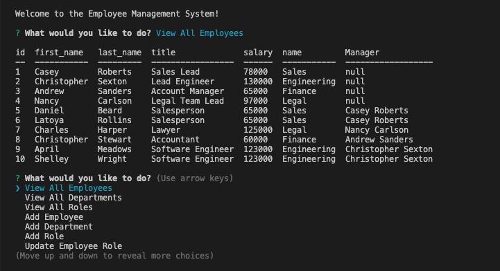
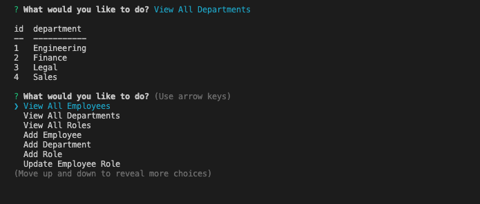
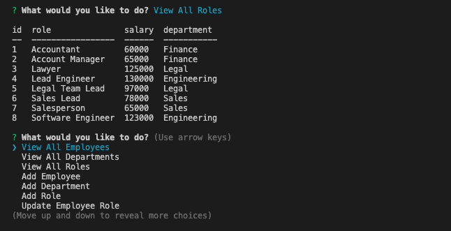
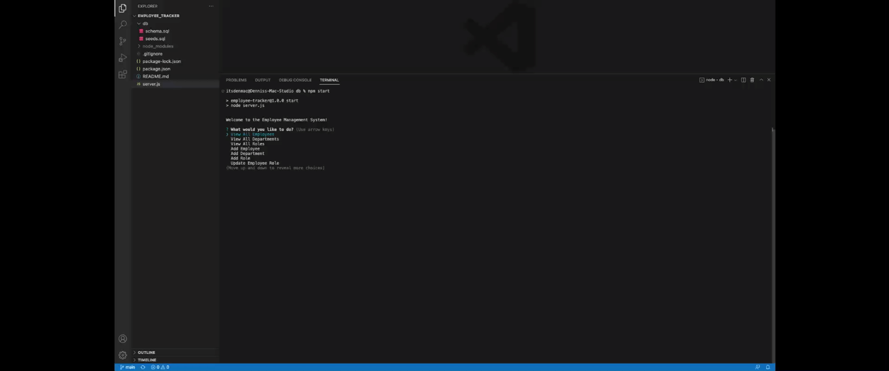
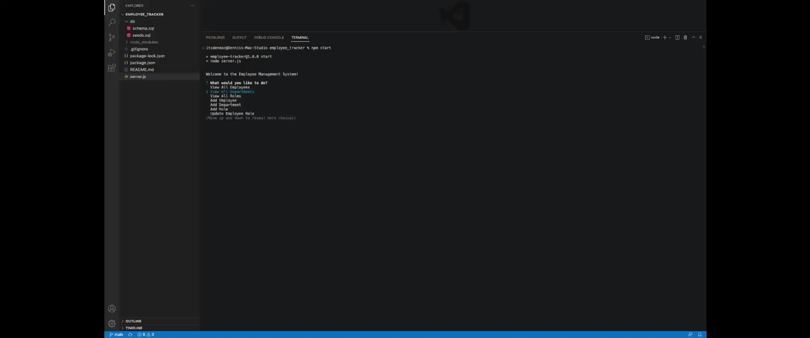
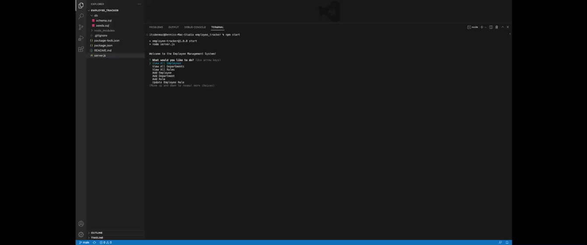
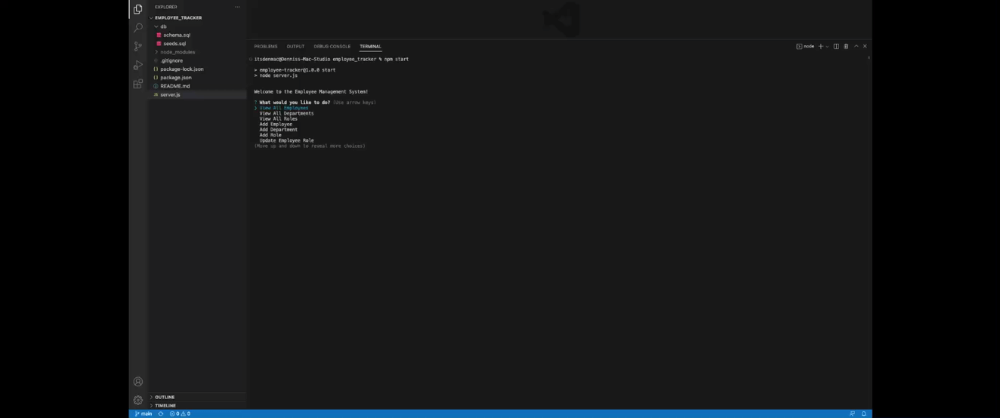

# Employee Tracker
This is a command-line application to manage a company's employee database.

This application is created from scratch, using Node.js, Inquirer, and MySQL, to exhibit the interaction between users and information stored in databases.

## Installation

In able to execute the application, you will have to `git clone` the repository to your local storage. This will enable you to access all the files locally.

Run `npm install` in order to have the following npm package dependencies installed. 

* The application will start once the user enters `npm start` in the command line.
* The application will run in the command line, following prompts.

## Usage
* User will be able to select between the following options: 
    > View all Employees

    > View all Departments

    > View all Roles

    > Add an Employee

    > Add a Department

    > Add a Role

    > Update an Employee Role

* User will be provided with more prompts to follow every selections made.
* User will have the ability to exit the application by selecting `Exit`.

## Demo
* View all employees

* View all departments

* View all roles

* Add a new employee

* Add a new department

* Add a new role

* Update an employee role

### Video Link to Full Demo

[DEMO VIDEO LINK](https://drive.google.com/file/d/1Fmfc25_zxWHg6O3ghC2yc_BbBCyCiXas/view)

